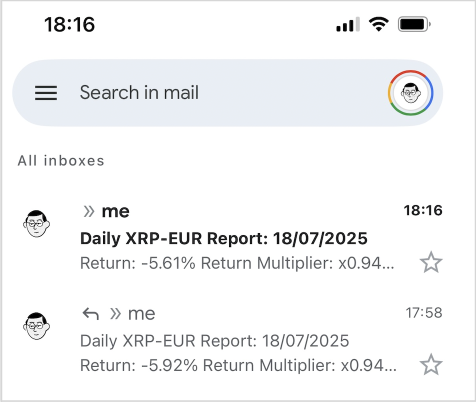
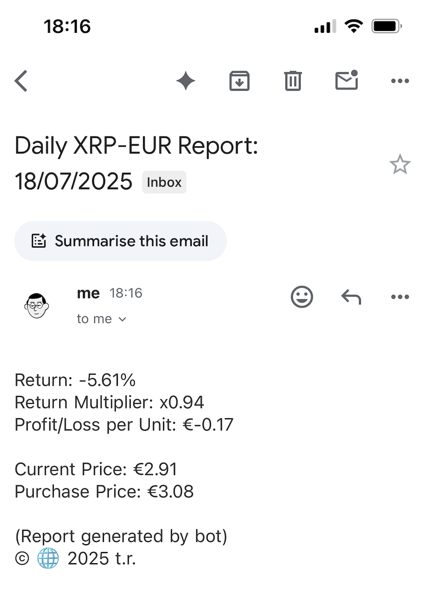

# 📥 CNB_Daily-Crypto-Report

<p align="left">
  
  
</p>

> This project is a Python script that automatically fetches the price of a specified cryptocurrency from Coinbase, calculates its return against a predefined purchase price, and sends a daily report via email. The project is designed to be easily configurable and can be automated to run daily using GitHub Actions.

### Outline

- [Features](#features)
- [Prerequisites](#prerequisites)
- [Installation](#installation)
- [Automation](#automation)
- [Customization](#customization)

---

## Features

* Fetches the latest cryptocurrency prices from Coinbase.
* Calculates the return and profit/loss of your investment.
* Calculates a return multiplier (e.g., x1.5 or x0.8) for a quick view of your investment's status.
* Sends a formatted email report with the current date in the subject.
* Can be automated to run on a schedule using GitHub Actions.
* Securely handles API keys and other sensitive information using environment variables.

### Example

Screenshots of the inbox report schedule using XRP-EUR as an example:

*Inbox Level-1:*

<p align="left">
  
</p>

*Inbox Level-2:*

<p align="left">
  
</p>

## Prerequisites

Before you begin, ensure you have the following:

* Python 3.6 or higher
* A Coinbase account with API credentials (API Key and API Secret)
* A Gmail account with an App Password
* Git (for cloning the repository)

## Installation

1.  **Clone the repository:**
    ```bash
    git clone [https://github.com/tomas-ravalli/coinbase-report.git](https://github.com/tomas-ravalli/coinbase-report.git)
    cd coinbase-report
    ```

2.  **Create a virtual environment:**
    ```bash
    python3 -m venv venv
    source venv/bin/activate
    ```

3.  **Install the dependencies:**
    ```bash
    pip install -r requirements.txt
    ```

## Usage

To use this script, you need to configure your environment variables.

1.  **Create a `.env` file** in the root directory of the project.

2.  **Add the following environment variables** to the `.env` file with your own credentials/data:
    ```
    COINBASE_API_KEY="YOUR_COINBASE_API_KEY"
    COINBASE_API_SECRET="YOUR_COINBASE_API_SECRET"
    GMAIL_ADDRESS="YOUR_GMAIL_ADDRESS"
    GMAIL_APP_PASSWORD="YOUR_GMAIL_APP_PASSWORD"
    RECIPIENT_EMAIL="THE_EMAIL_ADDRESS_TO_SEND_THE_REPORT_TO"
    PURCHASE_PRICE="YOUR_PURCHASE_PRICE"
    ```

3.  **Run the script manually:**
    ```bash
    python report.py
    ```

## Automation

This repository includes a **GitHub Actions** workflow to automate the daily execution of the report. To use it, you need to set up secrets in your forked GitHub repository.

1. **Fork this repository.**

2. **Go to your repository's settings** > **Secrets and variables** > **Actions**.

3. **Create the following secrets** with your credentials/data:
    * `COINBASE_API_KEY`
    * `COINBASE_API_SECRET`
    * `GMAIL_ADDRESS`
    * `GMAIL_APP_PASSWORD`
    * `RECIPIENT_EMAIL`
    * `PURCHASE_PRICE`

The workflow is configured to run at ~08:00AM CEST daily. You can also trigger it manually from the Actions tab in your repository.

## Customization

You can customize the script to track a different or multiple cryptocurrencies.

1. **Open the `report.py` file.**
2. **Change the `CURRENCY_PAIR`** to the desired currency pair (e.g., 'BTC-USD', 'ETH-EUR').
    ```python
    CURRENCY_PAIRS = ['YOUR-CRYPTO-PAIR-1', 'YOUR-CRYPTO-PAIR-2']

</br>

<p align="center">© 🌐 2025 t.r.</p>
