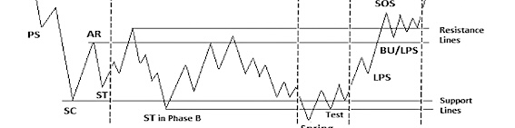
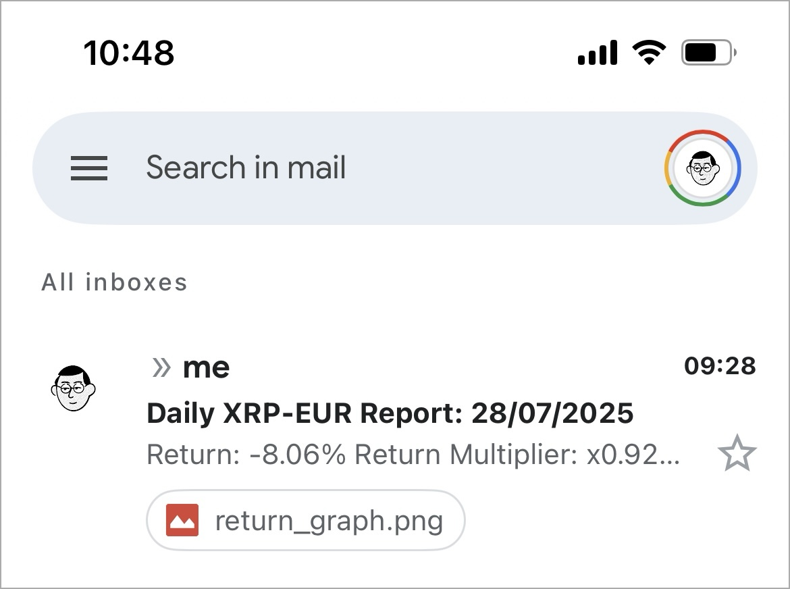

# 📥 Automated Daily Crypto Brief via e-mail

<p align="left">
  
</p>

> A Python script that automatically fetches the price of a specified cryptocurrency from Coinbase, calculates its return against the average of your purchase prices, and sends a daily basic report via email. Designed to be easily configurable and can be automated to run daily using GitHub Actions.

### Outline

- [Features](#features)
- [Prerequisites](#prerequisites)
- [Installation](#installation)
- [Usage](#usage)
- [Automation](#automation)
- [Customization](#customization)

---

## Features

- Fetches the latest cryptocurrency prices from Coinbase.
- Calculates the simple average of your investment's purchase prices.
- Calculates return, profit/loss per unit, and a return multiplier.
- Sends a formatted email report – generates and embeds a weekly performance chart directly into the email.
- Can be automated to run on a schedule using GitHub Actions.
- Securely handles API keys and other sensitive information using environment variables.

### Example

Screenshots of the inbox report schedule using XRP-EUR as an example:

<p align="left">
  
    <br>
  <em>Fig. 1: Example report at inbox level-1.</em>
</p>

</br>

<p align="left">
  
    <br>
  <em>Fig. 2: Example report at inbox level-2.</em>
</p>


## Prerequisites

Before you begin, ensure you have the following:

- Python 3.6 or higher
- A Coinbase account with API credentials (API Key and API Secret)
- A Gmail account with an App Password
- Git (for cloning the repository)

## Installation

1. **Clone the repository:**

    ```bash
    git clone [https://github.com/tomas-ravalli/cnb-daily-crypto-report.git](https://github.com/tomas-ravalli/cnb-daily-crypto-report.git)
    cd cnb-daily-crypto-report
    ```

2. **Create a virtual environment:**

    ```bash
    python3 -m venv venv
    source venv/bin/activate
    ```

3. **Install the dependencies:**

    ```bash
    pip install -r requirements.txt
    ```

## Usage

To use this script, you need to configure your environment variables.

1. **Create a `.env` file** in the root directory of the project.

2. **Add the following environment variables** to the `.env` file with your own credentials/data:

    ```bash
    COINBASE_API_KEY="YOUR_COINBASE_API_KEY"
    COINBASE_API_SECRET="YOUR_COINBASE_API_SECRET"
    GMAIL_ADDRESS="YOUR_GMAIL_ADDRESS"
    GMAIL_APP_PASSWORD="YOUR_GMAIL_APP_PASSWORD"
    RECIPIENT_EMAIL="THE_EMAIL_ADDRESS_TO_SEND_THE_REPORT_TO"
    PURCHASE_PRICES="PRICE1;PRICE2;..."
    ```

    **Important:** The `PURCHASE_PRICES` variable must be a string with each price separated by a semicolon (`;`).

    *Example:*
    `PURCHASE_PRICES="0.45;0.51;0.48"`

3. **Run the script manually:**

    ```bash
    python report.py
    ```

## Automation

This repository includes a **GitHub Actions** workflow to automate the daily execution of the report. To use it, you need to set up secrets in your forked GitHub repository.

1. **Fork this repository.**

2. **Go to your repository's settings** > **Secrets and variables** > **Actions**.

3. **Create the following secrets** with your credentials/data:
    - `COINBASE_API_KEY`
    - `COINBASE_API_SECRET`
    - `GMAIL_ADDRESS`
    - `GMAIL_APP_PASSWORD`
    - `RECIPIENT_EMAIL`
    - `PURCHASE_PRICES`

The workflow is configured to run at ~07:00AM CEST daily. You can also trigger it manually from the Actions tab in your repository.

## Customization

You can customize the script to track a different cryptocurrency.

1. **Open the `report.py` file.**
2. **Change the `CURRENCY_PAIR`** to the desired currency pair (e.g., 'BTC-USD', 'ETH-EUR').

    ```python
    CURRENCY_PAIR = 'YOUR-CRYPTO-PAIR'
    ```

</br>

> [!WARNING]
> The report and metrics included are not exhaustive and are intended for superficial monitoring purposes only.

</br>

<p align="center">🌐 © 2025 t.r.</p>
