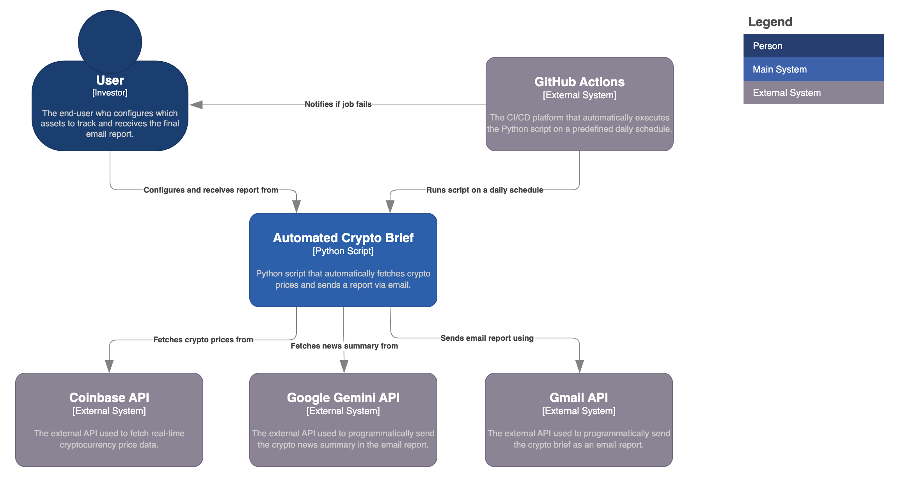

# Automated Daily Crypto Brief via Email

<p align="left">
  
</p>

A Python script that automatically fetches cryptocurrency prices from Coinbase, generates a concise news summary, and sends a comprehensive daily brief via email. Designed to be easily configurable and can be scheduled to run daily using GitHub Actions.

### Outline

- [Features](#features)
- [Architecture](#architecture)
- [Installation](#installation)
- [Usage](#usage)
- [Structure](#structure)

---

## Features

- Fetches the latest crypto prices from Coinbase.
- Fetches a daily news summary for the specified crypto using the Google Gemini API.
- Calculates the simple average of your investment's purchase prices.
- Calculates return, profit/loss per unit, and a return multiplier.
- Sends a formatted email report –generates and embeds a weekly performance chart directly into the email.
- Can be automated to run on a schedule using GitHub Actions.
- Securely handles API keys and other sensitive information using environment variables.

### Example

<p align="left">
  
    <br>
  <em>Fig. 1: An example of the daily XRP brief in an inbox.</em>
</p>

### Prerequisites

Before you begin, ensure you have the following:

- Python 3.6 or higher
- A Coinbase account with API credentials (API Key and API Secret)
- Google AI Studio account with a Gemini API Key
- A Gmail account with an App Password
- Git (for cloning the repository)

## Architecture

<p align="center">
  
    <br>
  <em>Fig. 1: [System Context Diagram] Automated Crypto Brief.</em>
</p>

## Installation

1. **Clone** the repository:

    ```
    git clone https://github.com/tomas-ravalli/automated-crypto-brief.git
    cd automated-crypto-brief
    ```

2. **Create** a virtual environment:

    ```
    python3 -m venv venv
    source venv/bin/activate
    ```

3. **Install** the dependencies:

    ```
    pip install -r requirements.txt
    ```

## Usage

To use this script, you need to configure your environment variables.

1. **Create** a `.env` file in the root directory of the project.

2. **Add** the following environment variables to the `.env` file with your own credentials/data:

    ```
    # Coinbase Credentials
    COINBASE_API_KEY="YOUR_COINBASE_API_KEY"
    COINBASE_API_SECRET="YOUR_COINBASE_API_SECRET"
    
    # Google Gemini Credentials
    GEMINI_API_KEY="YOUR_GEMINI_API_KEY"

    # Gmail Credentials
    GMAIL_ADDRESS="YOUR_GMAIL_ADDRESS"
    GMAIL_APP_PASSWORD="YOUR_GMAIL_APP_PASSWORD"
    RECIPIENT_EMAIL="THE_EMAIL_ADDRESS_TO_SEND_THE_REPORT_TO"

    # Investment Data
    PURCHASE_PRICES="PRICE1;PRICE2;..."
    ```

    **Important:** The `PURCHASE_PRICES` variable must be a string with each price separated by a semicolon (`;`).

3. **Run** the script manually:

    ```
    python src/report.py
    ```

### Automation

This repository includes a **GitHub Actions** workflow to automate the daily execution of the report. To use it, you need to set up secrets in your forked GitHub repository.

1. **Fork** this repository.

2. **Go** to your repository's settings > Secrets and variables > Actions.

3. **Create** the following secrets with your credentials/data:
    - `COINBASE_API_KEY`
    - `COINBASE_API_SECRET`
    - `GEMINI_API_KEY`
    - `GMAIL_ADDRESS`
    - `GMAIL_APP_PASSWORD`
    - `RECIPIENT_EMAIL`
    - `PURCHASE_PRICES`

The workflow is configured to run at ~07:00AM CEST daily. You can also trigger it manually from the Actions tab in your repository.

### Customization

You can customize the script to track a different crypto.

1. **Open** the `src/report.py` file.
2. **Change** the `CURRENCY_PAIR` to the desired currency pair (e.g., 'BTC-USD', 'ETH-EUR').

    ```python
    CURRENCY_PAIR = 'YOUR-CRYPTO-PAIR'
    ```

## Structure

```
automated-crypto-brief/
├── .github/                      
│   └── workflows/
│       └── daily-report.yml      # GitHub Actions file to automate running the script.
├── .gitignore                    
├── LICENSE                       
├── README.md                     # The main documentation for the repository. <--YOU ARE HERE
├── requirements.txt              # A list of the Python packages needed to run the project.
├── assets/                       
├── data/                         
│   └── historical_data.csv       # The raw data your script will read and process.
├── reports/                      
│   └── weekly_report_chart.png   # The chart created by the automation.
└── src/                          
    └── report.py                 # The main Python script that performs the analysis and generates the report.
```

</br>

> [!WARNING]
> The report and metrics included are not exhaustive and are intended for superficial monitoring purposes only.

</br>

<p align="center">🌐 © 2025 t.r.</p>
